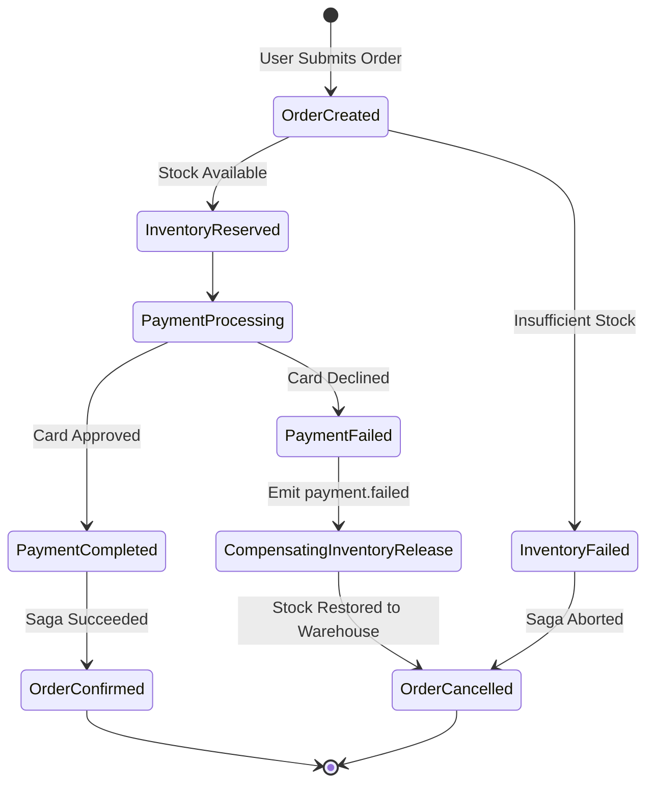

# Section 5: Distributed Systems Skill & Interview Master Reference

This document serves as the foundational engineering reference for **Event-Driven Architecture with Microservices**, the **Saga Pattern**, **Transactional Outbox**, **Idempotent Consumers**, **Dead Letter Queues**, and **Distributed Tracing**.

---

## 1. Event-Driven Architecture and Message Brokers

### Core Principles
- **Loose Coupling**: Producers publish domain events without knowing who consumes them or how many consumers exist.
- **Temporal Decoupling**: The producer and consumers do not need to be online at the exact same moment. Messages persist durably in Kafka topic log partitions.
- **Asynchronous Non-Blocking Execution**: High-volume ingestion paths (e.g., `POST /api/orders`) return `202 Accepted` in sub-20ms, delegating resource-heavy operations (payment settlement, inventory allocation) to asynchronous worker pools.

### Message Ordering & Partitioning
- Kafka guarantees total order **strictly within a partition**, not across partitions.
- **Partition Key Strategy**: Always key domain events by their aggregate root ID (e.g., `orderId` or `customerId`). All events for the same order (`order.created`, `inventory.reserved`, `payment.completed`) hash to the **exact same partition**, guaranteeing sequential, race-condition-free consumer evaluation.

```mermaid
flowchart LR
    Producer[Order / Payment Services] -->|Key: orderId| Partitioner{Kafka Partitioner}
    Partitioner -->|Hash(orderId) % 3 = 0| Partition0[Partition 0\nOrder-123 events in strict order]
    Partitioner -->|Hash(orderId) % 3 = 1| Partition1[Partition 1\nOrder-456 events in strict order]
    Partitioner -->|Hash(orderId) % 3 = 2| Partition2[Partition 2\nOrder-789 events in strict order]
```

---

## 2. The Dual-Write Problem & The Transactional Outbox Pattern

### The Problem
When a service needs to update its local database AND publish an event to Kafka, doing both in application code creates an unavoidable failure window:
1. *Write DB -> Publish Kafka*: If the app crashes or network drops before publishing, the database has changed but the rest of the system never learns about it.
2. *Publish Kafka -> Write DB*: If Kafka succeeds but the DB transaction fails/rolls back, downstream services act on an event that never existed in the source database.

### The Solution: Transactional Outbox
1. In the **same local ACID database transaction**, insert the domain row (e.g. `orders`) AND an event record into an `outbox_events` table.
2. A separate background worker (`OutboxRelay`) or CDC engine (Debezium) reads `PENDING` outbox records, publishes them to Kafka, and upon receiving the Kafka ACK, marks them `SENT`.

```mermaid
sequenceDiagram
    autonumber
    actor Client
    participant OrderService
    participant LocalDB as Order DB (PostgreSQL)
    participant OutboxRelay
    participant Kafka

    Client->>OrderService: POST /api/orders
    rect rgb(30, 45, 60)
        Note over OrderService,LocalDB: Single Local ACID Transaction
        OrderService->>LocalDB: INSERT INTO orders (status = 'PENDING')
        OrderService->>LocalDB: INSERT INTO outbox_events (status = 'PENDING')
    end
    OrderService-->>Client: 202 Accepted (orderId, status: PENDING)

    loop Polling / CDC Stream
        OutboxRelay->>LocalDB: SELECT * FROM outbox_events WHERE status = 'PENDING'
        OutboxRelay->>Kafka: Publish to 'order.created' (Key: orderId)
        Kafka-->>OutboxRelay: RecordMetadata ACK
        OutboxRelay->>LocalDB: UPDATE outbox_events SET status = 'SENT'
    end
```



---

## 3. Saga Pattern and Compensating Transactions

### Orchestration vs. Choreography
- **Choreography (Used here)**: Each service listens to domain events and decides its own action and whether to publish new events. Decentralized, loosely coupled, and ideal for linear workflows.
- **Orchestration**: A central orchestrator service coordinates the entire workflow via commands. Better for complex workflows with branching logic.

### Compensating Transactions
Distributed systems cannot use two-phase commit (2PC) at scale due to blocking coordinator bottlenecks. Sagas replace ACID with **ACID across steps + Compensating Actions**:
- If Step $N$ fails, compensating events are dispatched backwards to revert steps $N-1, N-2, \dots, 1$.
- Example in our pipeline:
  1. `order-service` creates order ($T_1$).
  2. `inventory-service` reserves 2 units ($T_2$).
  3. `payment-service` card charge fails ($T_3$ Failure).
  4. `payment-service` publishes `payment.failed`.
  5. `inventory-service` consumes `payment.failed` and executes compensating transaction $C_2$: adds 2 units back to available stock.
  6. `order-service` consumes `payment.failed` and executes $C_1$: marks order `CANCELLED`.



---

## 4. Idempotent Consumer Design

### Why At-Least-Once Delivery Requires Idempotency
Network acknowledgments can be lost even if a message was processed. Message brokers retry delivery, resulting in **duplicate messages**.

### Deduplication Strategy
1. Every event envelope carries a globally unique `eventId` (UUID).
2. The consumer maintains a `processed_events` table (`eventId` PRIMARY KEY, `consumerGroup`, `processedAt`).
3. Inside the consumer's local database transaction:
   - Check if `eventId` exists.
   - If exists -> Drop message / skip business logic.
   - If not -> Execute business logic + `INSERT INTO processed_events`.

```java
// Idempotency execution pattern
if (processedEventRepository.existsById(eventId)) {
    log.warn("Duplicate event detected [id={}]. Skipping side effects.", eventId);
    return;
}
executeBusinessLogic();
processedEventRepository.save(new ProcessedEvent(eventId, eventType, consumerGroup));
```

---

## 5. Eventual Consistency Reasoning

### The Mental Shift from ACID to BASE
- **ACID**: Immediate consistency. Reads immediately reflect the latest write across all tables.
- **BASE** (*Basically Available, Soft state, Eventual consistency*): Data reaches consistency over time as events propagate across asynchronous queues.

### Handling UX & Client Queries
1. **HTTP 202 Accepted + Polling / WebSockets / SSE**: The API returns immediately with an `orderId` and status `PENDING`.
2. **Read-Your-Own-Writes / Optimistic UI**: The frontend displays "Processing Order..." and opens an SSE stream or polls `GET /api/orders/{id}` until the status transitions to `CONFIRMED` or `CANCELLED`.

---

## 6. Dead Letter Queues (DLQ) and Error Handling

### Failure Classification
1. **Transient Failures (Retryable)**: Network timeout, momentary database lock contention. Handled via exponential backoff (e.g., 3 retries at 1s, 2s, 4s).
2. **Poison Pills (Non-Retryable)**: Malformed JSON, NullPointerExceptions, schema incompatibility. Retrying endlessly blocks partition consumption.

### DLQ Strategy & Replay Engine
- After retry exhaustion, Spring Kafka `@RetryableTopic` routes the failed record to a dedicated dead-letter topic (e.g., `inventory.reserved.DLT`).
- The **`dlq-admin-service`** consumes these topics, stores the poisoned payload, stack trace, and original topic in a dashboard.
- Engineers inspect the root cause, fix upstream bugs, and invoke `POST /api/dlq/replay/{id}` to redeliver the corrected message into the live pipeline.

---

## 7. Distributed Tracing with OpenTelemetry

### Context Propagation across Async Boundaries
- Synchronous HTTP requests pass W3C TraceContext headers (`traceparent: 00-{traceId}-{spanId}-01`).
- Asynchronous Kafka messages serialize `traceId` and `spanId` into **Kafka Record Headers**.
- Downstream consumers extract the header, set the MDC logging context, and attach their child spans to the parent trace.
- A single `traceId` connects:
  `Order Service (POST /orders) -> Kafka (order.created) -> Inventory Service -> Kafka (inventory.reserved) -> Payment Service -> Kafka (payment.completed) -> Notification Service`.

---

## 8. Resume Bullet Points

- *Architected and deployed an event-driven order processing pipeline across 4 microservices using Spring Boot 3, Apache Kafka, and PostgreSQL, decoupling synchronous bottlenecks and achieving sub-25ms API response latency.*
- *Eliminated dual-write discrepancies and data loss by implementing the Transactional Outbox pattern and an asynchronous relay scheduler, ensuring 100% at-least-once event delivery.*
- *Implemented choreographed Saga with compensating transactions to guarantee eventual consistency and automated inventory rollback across distributed database schemas upon payment declines.*
- *Designed idempotent consumers backed by persistent deduplication keys, successfully handling duplicate message storms with zero double-charging or duplicate inventory reservations.*
- *Constructed an automated Dead Letter Queue (DLQ) topology with exponential backoff retries and an administrative replay dashboard for zero-data-loss incident mitigation.*
- *Integrated OpenTelemetry and Jaeger distributed tracing across HTTP endpoints and Kafka record headers, enabling full end-to-end request visibility across isolated service boundaries.*
